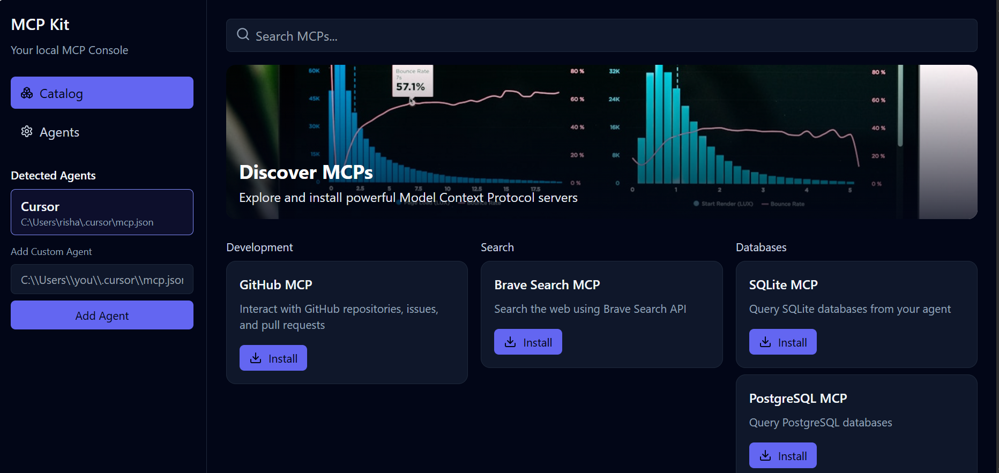

# MCP Kit

A lightweight UI console to detect MCP-capable agents and install MCP servers. Easily manage Model Context Protocol integrations for Cursor, Windsurf, and other AI coding assistants.



## 🚀 Quick Start

### Option 1: NPX (Recommended - No Installation)
```bash
npx mcp-kit
```
No installation required! Runs immediately and caches for faster subsequent runs.

### Option 2: Global Installation
```bash
npm install -g mcp-kit
mcp-kit
```

### Option 3: Local Installation
```bash
npm install mcp-kit
npx mcp-kit
```

## ✨ Features

- **Auto-Detection**: Automatically finds Cursor, Windsurf, and other MCP-capable agents
- **Live Registry**: Always up-to-date MCP server catalog from GitHub
- **One-Click Install**: Install MCP servers with environment variable configuration
- **OAuth Support**: Handle authentication flows for services like GitHub
- **Offline Fallback**: Works even when GitHub is unavailable
- **Cross-Platform**: Windows, macOS, and Linux support

## 🎯 Supported Agents

- **Cursor** - AI-powered code editor
- **Windsurf** - AI coding assistant
- **Custom Agents** - Add your own MCP-compatible tools

## 📦 Installation Methods

### NPX (No Installation Required)
```bash
# Latest version
npx mcp-kit

# Specific version
npx mcp-kit@1.2.3

# Force update
npx mcp-kit@latest --force
```

**Pros:**
- ✅ No installation required
- ✅ Always latest version
- ✅ No system pollution
- ✅ Easy to try
- ✅ Works offline after first run

**Cons:**
- ❌ Requires Node.js
- ❌ Slower first run (downloads package)

### Global Installation
```bash
npm install -g mcp-kit
# or
yarn global add mcp-kit
```

**Pros:**
- ✅ Fast startup
- ✅ Works offline
- ✅ Version control
- ✅ Available as `mcp-kit` command

**Cons:**
- ❌ Requires Node.js
- ❌ Manual updates needed

### Local Installation
```bash
npm install mcp-kit
npx mcp-kit
```

**Pros:**
- ✅ Project-specific installation
- ✅ Version pinning
- ✅ Works offline

**Cons:**
- ❌ Requires Node.js
- ❌ Must run from project directory

## 🛠️ Development

### Prerequisites
- Node.js 16+
- npm or yarn

### Setup
```bash
git clone https://github.com/cybertheory/mcpkit.git
cd mcpkit
npm install
npm run dev
```

### Building
```bash
# Build web assets
npm run build

# Publish to npm
npm publish
```

## 📋 Usage

1. **Start MCP Kit**: Run `npx mcp-kit` or `mcp-kit` (if installed globally)
2. **Select Agent**: Choose your coding agent (Cursor, Windsurf, etc.)
3. **Browse Catalog**: Explore available MCP servers
4. **Install**: Click install and configure environment variables
5. **Use**: Restart your agent to use the new MCP servers

## 🔧 Configuration

MCP Kit automatically detects agent configurations, but you can manually specify paths if needed:

- **Cursor**: `~/.cursor/mcp.json`
- **Windsurf**: `~/.windsurf/mcp.json`
- **Custom**: Specify any JSON configuration file

## 🌐 Registry

The MCP registry is automatically updated from [GitHub](https://github.com/cybertheory/mcpkit) every 30 minutes. You can manually refresh using the "Refresh Registry" button in the UI.

## 🚀 Publishing

To publish a new version:

```bash
# Update version
npm version patch  # or minor, major

# Build and publish
npm run build
npm publish
```

## 🤝 Contributing

1. Fork the repository
2. Create a feature branch
3. Make your changes
4. Submit a pull request

## 📄 License

MIT License - see [LICENSE](LICENSE) file for details.

## 🆘 Support

- **Issues**: [GitHub Issues](https://github.com/cybertheory/mcpkit/issues)
- **Discussions**: [GitHub Discussions](https://github.com/cybertheory/mcpkit/discussions)
- **Documentation**: [Wiki](https://github.com/cybertheory/mcpkit/wiki)

---

**Made with ❤️ for the MCP community**